---
output:
  xaringan::moon_reader:
    css: css/xaringan-themer-ana.css
    self_contained: true
    
    nature:
      slideNumberFormat: "%current%"
      highlightStyle: github
      cache: true
      seal: false
      highlightLines: true
      ratio: 16:9
      countIncrementalSlides: false
---
```{r setup, include=FALSE}
options(htmltools.dir.version = FALSE)
#knitr::include_graphics()
knitr::opts_chunk$set(
  fig.width=9, fig.height=3.5, fig.retina=3,
  out.width = "100%",
  cache = TRUE,
  echo = TRUE,
  message = FALSE, 
  warning = FALSE,
  hiline = TRUE
)
```
```{r xaringan-themer, include=FALSE, warning=FALSE}
library(xaringanthemer)
# style_duo_accent(
#   primary_color = "#1381B0",
#   secondary_color = "#FF961C",
#   inverse_header_color = "#FFFFFF",
#   title_slide_text_color = "#FFFFFF"
# )
```

class: title-slide
background-image: url('images/R.png')
background-size: contain

---

# Índice:

- Conceptos básicos de estadística

- Tests estadísticos y suposiciones

- Tests de correlación en R

- Comparando medias en R

- Comparando proporciones en R
 
---
class: invert center middle

# Conceptos básicos de estadística

---

# Introducción:

La estadística son los métodos y procedimientos para recoger, clasificar, analizar y representar los datos, así como obtener conclusiones a través de ellos, con la intención de formular predicciones y ayudar en la toma de decisiones.

--

Existen dos tipos principales de estadística:

1. **Estadística descriptiva**: es la parte de la estadística que se ocupa de ordenar, sintetizar y representar gráficamente los resultados recogidos durante la investigación.

--

2. **Estadística inferencial**: es la estadística que tiene como objetivo obtener conclusiones sobre el total de la *_población_* a partir de los datos obtenidos en un subconjunto de la misma o grupo de elementos representativos (*_muestra_*).

???

Hoy nos vamos a centrar en la estadística inferencial. 
Aquí introducimos dos conceptos básicos, población: es el total de individuos o conjunto de ellos que presentan o podrían presentar el rasgo característico que se desea estudiar. Muestra:  es un subconjunto de datos perteneciente a una población de datos. Estadísticamente hablando, debe estar constituido por un cierto número de observaciones que representen adecuadamente el total de los datos.

---
## Conceptos principales

???

Algunos de los principales conceptos en estadística a partir de los cuales podemos profundizar en ella son:

--
- *Aleatoriedad de una muestra*: es la característica mediante la cual todos los miembros de una muestra tienen las mismas posibilidades de formar parte de la misma.

???

Una muestra se ha recogido de manera aleatoria cuando todos los miembros de una muestra tienen las mismas posibilidades de formar parte de la misma. Si yo quiero estudiar los fumadores españoles, tengo que incluir fumadores de todo el territorio de manera proporcional (a nivel de comunidades autónomas) y aleatoria.(Edad, genero, ubicación de la recogida de muestras) para obtener una muestra totalmente aleatoria y homogenea.
--

- *Homogeneidad de una muestra*: es la característica mediante la cual las variables de la muestra se presentan en la misma proporción que las de la población.

???

Y en este sentido, no puedo recoger muestras de patios de instituto en madrid, de campos de futbol en valencia y de geriàtricos en Vigo. Voy a tener una muestra muy poco homogenea a nivel de edad y género.
--

- *Variable*: es una característica observable que varía entre los diferentes individuos de una población

???

Variables; son las características de la población que se representan en los individuos que forman la muestra y que son susceptibles de ser medidas. Las variables pueden ser cuantitativa o cualitativas. Cuantos cigarros fuman. O a otro ejemplo, la altura de las personas.
--

- *Dato*: valor particular de la variable

???

Mi altura concreta
--

- *Estadístico*: es un índice que resume una determinada característica de la muestra. 

???
Estadístico; es un índice que resume una determinada característica de la muestra. Si nos consideramos a los presentes como una muestra poblacional, un estadístico posible seria nuestra altura media
--

- *Parámetro*: cantidad numérica calculada sobre la población.

???

Parámetro;Mismo que el estadístico a nivel poblacional. Si la altura media de las personas que estamos en la llamada era el ejemplo estadístico, cual sería el parámetro?
La altura media de los científicos con interés en bioinformática del país.

---

## Estadística inferencial

.pull-right[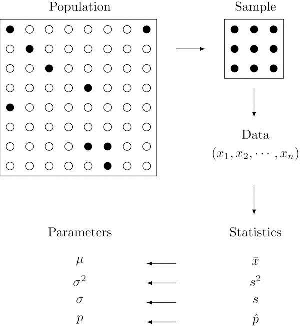]

Hay básicamente dos tipos de inferencia estadística.

1. estimación

2. prueba de hipótesis 


???

1. estimación (un proceso de estimación de los valores de los parámetros basados en datos empíricos medidos que tiene un componente aleatorio)

2. prueba de hipótesis (un proceso utilizado para evaluar la plausibilidad de una hipótesis mediante el uso de datos de muestra)


---

## Prueba de hipótesis

--

Plantear Hipótesis Nula e Hipótesis Alternativa.

La Hipótesis Nula se denota como $Ho$ y la Hipótesis Alternativa como $H1$.

La Hipótesis alternativa siempre plantea lo que queremos demostrar y la Hipótesis Nula se encarga de negarlo.

Por ejemplo:

En nuestro estudio probamos si una nueva intervención farmacológica puede aliviar los síntomas de una enfermedad autoinmune.
--

> En este caso:
> 
> - La hipótesis nula es que el nuevo fármaco no tiene efecto sobre los síntomas de la enfermedad.
> 
> - La hipótesis alternativa es que el fármaco es efectivo para aliviar los síntomas de la enfermedad.


---

## Una vez determinada la hipotesis:

Vamos a decidir si la hipótesis nula se puede rechazar según nuestros datos y los resultados de una prueba estadística. Dado que estas decisiones se basan en probabilidades, siempre existe el riesgo de llegar a una conclusión equivocada.

???
Vamos a hablar del error de tipo 1 y tipo 2, brevemente.

--

Si nuestros resultados muestran **_significancia estadística_**, eso significa que es muy poco probable que esto suceda si la hipótesis nula es verdadera. En este caso, rechazaría nuestra hipótesis nula. Pero a veces, esto puede ser un error de **_Tipo I_**.

???
Un error tipo I significa rechazar la hipótesis nula cuando en realidad es cierta. Significa concluir que los resultados son estadísticamente significativos cuando, en realidad, se produjeron por pura casualidad o por factores no relacionados.

El riesgo de cometer este error es el nivel de significación (alfa) que elijamos. Ese es un valor que se establece al comienzo del estudio para evaluar la probabilidad estadística de nuestro test (p.valor).
--

Si nuestros hallazgos no muestran significación estadística, tienen una alta probabilidad de que ocurran si la hipótesis nula es verdadera. Por lo tanto, no podemos rechazar nuestra hipótesis nula. Pero a veces, esto puede ser un error de **_Tipo II_**.

???

Un error tipo II significa no rechazar la hipótesis nula cuando en realidad es falsa. Esto no es exactamente lo mismo que "aceptar" la hipótesis nula, porque la prueba de hipótesis solo puede decirle si debe rechazar la hipótesis nula.

En cambio, un error de tipo II significa no poder concluir que hubo un efecto cuando en realidad lo hubo. En realidad, es posible que su estudio no haya tenido suficiente poder estadístico para detectar un efecto de cierto tamaño.

El poder es la medida en que una prueba puede detectar correctamente un efecto real cuando lo hay. El riesgo de un error de tipo II está inversamente relacionado con el poder estadístico de un estudio. Cuanto mayor sea el poder estadístico, menor será la probabilidad de cometer un error de tipo II.

--

> 
> En nuestro ejemplo: 
> 
> Error tipo I: Concluimos que la intervención farmacológica mejoró los síntomas cuando en realidad no fue así. Estas mejoras podrían haber surgido de otros factores aleatorios o errores de medición.
> 
> Error de tipo II: concluye que la intervención farmacológica no mejoró los síntomas cuando en realidad lo hizo. Su estudio puede haber omitido indicadores clave de mejoras o haber atribuido cualquier mejora a otros factores.
> 

---
class: middle

.pull-left[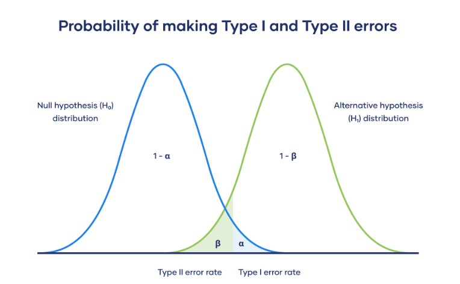]
.pull-right[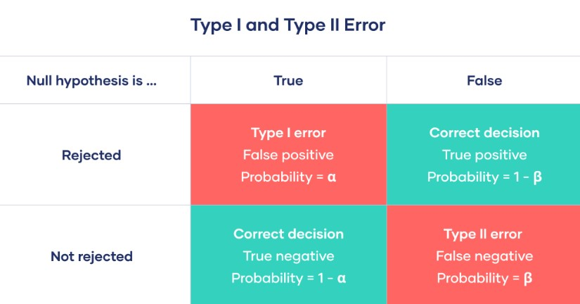]

.footnote[Fuente: https://www.scribbr.com/statistics/type-i-and-type-ii-errors]

---
class: center middle

## P.valor

se define como la probabilidad de que un valor estadístico calculado sea posible dada una hipótesis nula cierta. 

???

En términos simples, el valor p ayuda a diferenciar resultados que son producto del azar del muestreo, de resultados que son estadísticamente significativos.

---


---

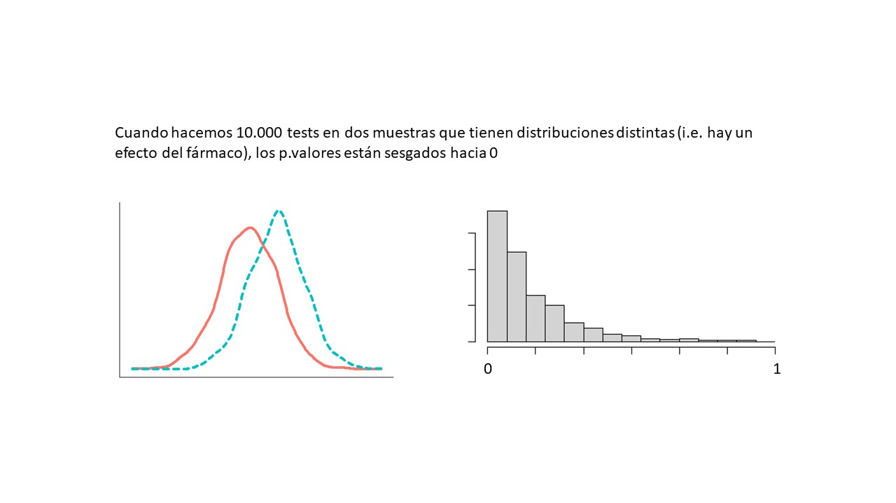

---

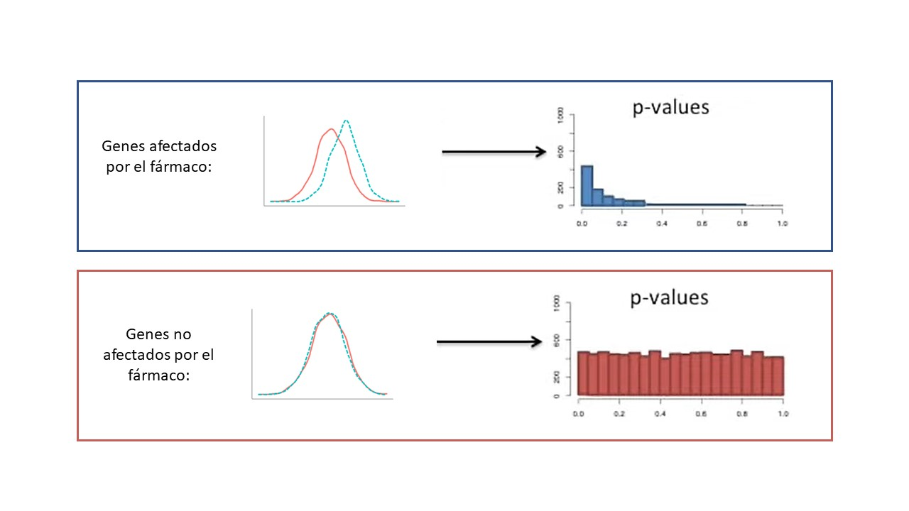

---

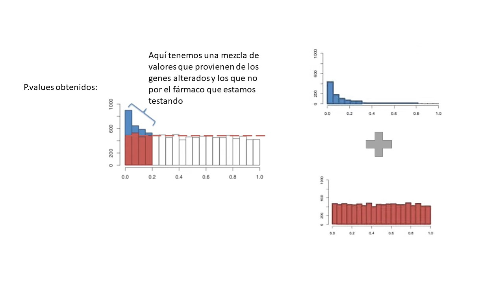


---
class: invert center middle

# Pruebas estadísticas y suposiciones

---
class: middle

Las **pruebas estadísticas** se emplean con la finalidad de establecer la probabilidad de que una conclusión que se obtiene a partir de una muestra sea aplicable a la población de la cual se obtuvo.

Para elegir la prueba estadística es necesario tomar en cuenta varios aspectos, relacionados con las variables (cuantitativas, cualitativas), la distribución de las mismas, y el diseño del estudio.

La elección de la prueba estadística adecuada facilitará la comprensión y aplicación de los resultados de cualquier estudio de investigación.
---

## Suposiciones

Generalmente podemos dividir las pruebas estadísticas en 2 conjuntos: las paramétricas y las no paramétricas. 

Las pruebas parametricas suponen ciertas características de los datos. En general:

- Los datos estan **normalmente distribuidos**


???
NORMALIDAD
- Comprobar con: Bondad de ajuste
o Shapiro-Wilk si n≤50
o Kolmogorov-Smirnov si n>50; media y varianza conocidas. Si desconocidas Lilliefors
- Si incumplimiento: Transformación logarítmica de los datos.

--

- homocedasticidad (la igualdad de las varianzas de las subpoblaciones)

--

Estos supuestos deben tomarse en serio para sacar una interpretación y conclusiones fiables de la investigación.
.center[]

---
## ¿Cómo evaluar la normalidad de los datos?

Podemos usar el qqplot normal o la prueba de significación de Shapiro-Wilk (`shapiro.test`) comparando la distribución de la muestra con una normal para determinar si los datos muestran o no una desviación grave de la normalidad.

## ¿Cómo evaluar la igualdad de varianzas?

Podemos utilizar el siguiente método para evaluar la igualdad de varianza de las muestras:

- F test (`var.test`) o la prueba de Bartlett (`bartlett.test`), cuando los datos se distribuyen normalmente;
- Prueba de Levene cuando hay evidencia de que los datos no se distribuyen normalmente

.footnote[En breves pasamos a la parte práctica y comprenderéis mejor lo que os comento 🤓]

---

**Pruebas estadísticas**
.float[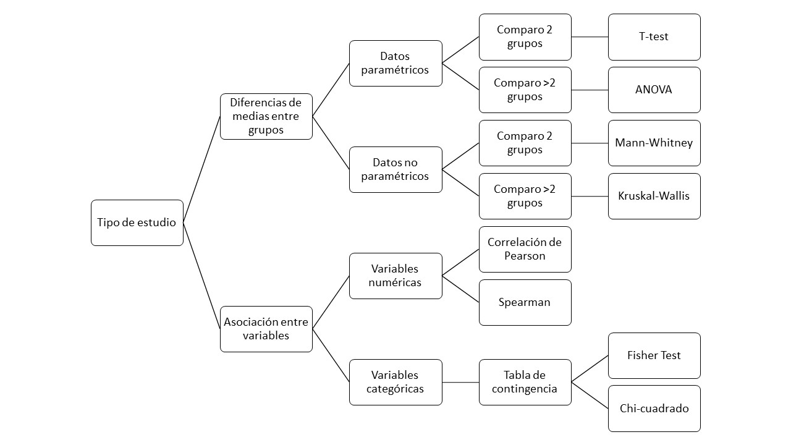]

---


https://rstudio.cloud/content/4390888 

---
class: center middle


---
class: center middle

# Tests de correlación en R

---

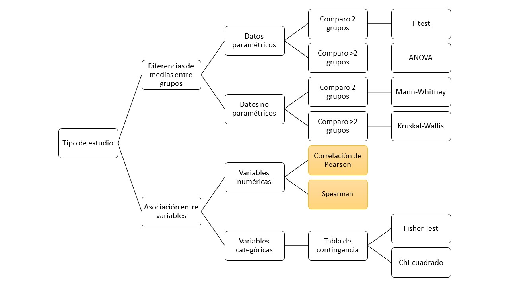

---

# Test de correlación

La prueba de correlación se utiliza para evaluar la asociación entre dos variables numéricas.

> En nuestro caso con el dataset Iris, queremos ver si la longitud y el ancho del sépalo estan asociados en todas las flores. 
> Miraremos también si la longitud y el ancho del pétalo estan asociados.


.center[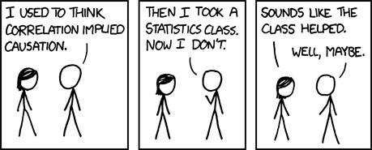]


.pull-right[
.footnote[
> 🔍 Cuál es nuestra hipótesis nula?
]
]

???
Por ejemplo, si estamos interesados en saber si existe una relación entre las estaturas de padres e hijos, se puede calcular un coeficiente de correlación para responder a esta pregunta. Si no hay relación entre las dos variables (alturas del padre y del hijo), la estatura promedio del hijo debe ser la misma independientemente de la estatura de los padres y viceversa.

---

## Métodos para análisis de correlación

**Correlación de Pearson** (r), que mide una dependencia lineal entre dos variables (x e y). También se conoce como prueba de correlación paramétrica porque depende de la distribución de los datos. Solo se puede usar cuando x e y pertenecen a una distribución normal. La gráfica de y=f(x) se denomina curva de regresión lineal.

**Kendall tau** y **Spearman rho**, que son coeficientes de correlación basados en rangos (no paramétricos)

.center[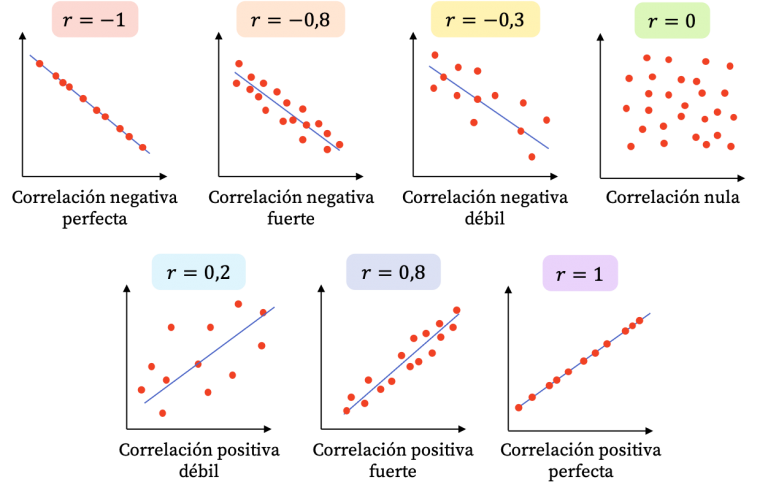]


---
class: middle

**Formula de correlación de Pearson**

$x$ e $y$ son vectores de longitud $n$.


$mx$ y $my$ son las medias de $x$ e $y$, respectivamente.


$$r=\frac{∑(x−mx)(y−my)}{ \sqrt{∑(x−mx)2(y−my)2}}$$

El p.value (nivel de significancia) de la correlación se puede determinar usando la tabla de coeficientes de correlación para los grados de libertad: $df=n−2$, donde $n$ es el número de observaciones en las variables $x$ e $y$.

---
class: middle

**Fórmula de correlación de Spearman**

El método de correlación de Spearman calcula la correlación entre el rango de $x$ y el rango de las variables $y$.

$$rho=\frac{∑(x′−mx′)(y′−my′)}{\sqrt{∑(x′−mx′)2(y′−my′)2}}$$
donde 

- $x'=rank(x)$ 
- $y'=rank(y)$.

---
class: middle
**Fórmula de correlación de Kendall**

El método de correlación de Kendall mide la correspondencia entre la clasificación de las variables $x$ e $y$. El número total de posibles parejas de $x$ con $y$ observaciones es $n(n−1)/2$, dónde $n$ es el tamaño de $x$ y $y$.

El procedimiento es el siguiente:

Comience ordenando los pares por los valores de $x$. Si $x$ y $y$ están correlacionados, tendrían el mismo orden de rango relativo.

Ahora, para cada $y_i$, cuente el número de $y_j>y_i$ (pares concordantes (c)) y el número de $y_j<y_i$ (pares discordantes (d)).

La distancia de correlación de Kendall se define de la siguiente manera:

$$tau=\frac{n_c−n_d}{\frac{1}{2}[n(n−1)]}$$
Dónde,

- $n_c$ : número total de pares concordantes
- $n_d$ : número total de pares discordantes
- $n$ : tamaño de $x$ y $y$

---

## Calcular correlaciones en R

El coeficiente de correlación se puede calcular usando las funciones `cor()` o `cor.test()`:

`cor()` calcula el coeficiente de correlación

`cor.test()` para asociación/correlación entre muestras pareadas. Devuelve tanto el coeficiente de correlación como el nivel de significación (o p.value) de la correlación

```{r, eval = F}
cor(x, y, method = c("pearson")) 
cor.test(x, y, method=c("spearman"))

# en method podemos determinar que test usar: 'pearson', "kendall" o "spearman"
```

También usaremos el paquete `ggpubr` para realizar análisis y visualizaciones al mismo tiempo


---
class: inverse center middle

# Hands on! 💻

---
class: center middle

# Comparando medias en R

---

.center[
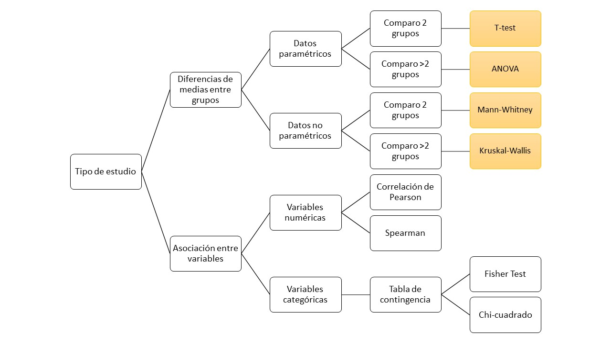
]

---

## Analisis de relación entre variable numérica y categórica

Si los datos en cada categoría son normales (p-valor shapiro test >= alpha) aplicamos:

- t.test (2 categorías)

- anova (> 2 categorías)

--

Si los datos en cada categoría no son normales (p-valor shapiro test < alpha) aplicamos:

- wilcoxon test (2 categorías)

- Kruskal-wallis (> 2 categorías)


---

# Ejemplo en las diapositivas:

```{r}
library(readxl); library(ggpubr)
mydata <- read_excel("datos/baby_study.xlsx")
mydata$mother_age<-factor(mydata$mother_age, levels = c(1,2,3), labels = c("<=30", "30-40", ">40"))
mydata$baby_low_weight <-factor(mydata$baby_low_weight, levels = c(0,1), labels = c("no", "yes"))
str(mydata)
```

---

>Ejemplo: 
**Analizar la posible relación entre el número de semanas de gestación y que el bebé tenga o no bajo peso**

`weeks_gestation` (numérica) y `baby_low_weight` (categórica)

--

Hacemos un histograma poniendo la variable numérica en la “x” y la categórica en “color” para tener una idea de la distribución de los datos.

```{r, out.width = "70%"}
gghistogram(mydata, 
            x="weeks_gestation",
            color="baby_low_weight",
            add = "mean",
            bins = 20)
```


---

Otra manera de tener una idea de la distribución de los datos seria con un resumen numérico por grupo:
```{r}
tapply(mydata$weeks_gestation, mydata$baby_low_weight, summary)
desc_statby(mydata,"weeks_gestation", "baby_low_weight") #  ggpubr 
```


???

length: the number of elements in each group
min: minimum
max: maximum
median: median
mean: mean
iqr: interquartile range
mad: median absolute deviation (see ?MAD)
sd: standard deviation of the mean
se: standard error of the mean
ci: confidence interval of the mean
range: the range = max - min
cv: coefficient of variation, sd/mean
var: variance, sd^2

---
O dibujando un boxplot:
```{r}
ggboxplot(mydata, 
            y="weeks_gestation",
            x="baby_low_weight",
            color = "baby_low_weight",
            )
```

??? 

A este mismo boxplot ya le podemos añadir la estadística
pero primero hay que determinar si la distribución y varianza de los grupos es igual!

---

**Analizar la posible relación entre el número de semanas de gestación y que el bebé tenga o no bajo peso**

--

Aplicamos el test de normalidad:

```{r}
tapply(mydata$weeks_gestation, mydata$baby_low_weight, function(x) shapiro.test(x))
```

.footnote[
> los datos siguen una distribución normal?
]
---

> los datos no siguen una distribución normal. Aplicaremos el test de Wilcoxon / Mann-Whitney

```{r}
wilcox.test(mydata$weeks_gestation~mydata$baby_low_weight)
```

.footnote[
> que p.valor hemos obtenido? nos permite descartar la hipótesis nula?
]

---

¡Vamos a graficar el resultado con `ggpubr`!

```{r, echo=T, out.width = "70%"}
ggboxplot(mydata, 
            y="weeks_gestation",
            x="baby_low_weight",
            color = "baby_low_weight",
            ) +
  stat_compare_means(method = 'wilcox.test', label.y=46)
```

---
class: center middle inverse

En este primer ejemplo hemos evaluado la posible relación entre el número de semanas de gestación y que el bebé tenga o no bajo peso. 

Vamos a irnos a RStudio Cloud (o R en vuestro ordenador) para hacer el segundo ejemplo juntos:

## Intentemos analizar la posible relación entre el peso inicial de la madre y que el bebé tenga bajo peso o no

???
Preguntar si prefieren que yo lo vaya haciendo o si quieren 5 minutos para empezarlo.
En el code.R tendrán el ejemplo que hemos hecho en las diapositivas y cuando finalize la 
sesión colgaré el code_ejercicio2.R con la respuesta.


---
class: center middle inverse

## Seguimos!
Hemos evaluado la posible relación entre una variable numerica y una categorica con dos grupos.
Vamos ahora a ver el caso en el que tenemos >2 grupos.

---

**Analizar la posible relación entre la edad de la madre i el peso del bebé**

???

cual es la variable numerica y cual la categorica en este caso?

--

```{r, echo=T, out.width = "90%"}
ggboxplot(mydata,x = "mother_age",
          y="baby_weight",
          fill = 'mother_age',
          add = 'jitter')
```

---
> Comprobamos si los datos siguen una distribución normal:

```{r}
tapply(mydata$baby_weight, mydata$mother_age, function(x) shapiro.test(x))
```

---

Entonces toca aplicar el test...
--
ANOVA.

Antes de eso, comprovemos las varianzas:

```{r}
?bartlett.test
# Performs Bartlett's test of the null that the variances 
# in each of the groups (samples) are the same
bartlett.test(mydata$baby_weight~mydata$mother_age)
```
--
> Las varianzas son homogeneas en los grupos, podemos hacer el test ANOVA

---

```{r anova}
aov(mydata$baby_weight~mydata$mother_age)
summary(aov(mydata$baby_weight~mydata$mother_age))
```


???
Df program: The degrees of freedom for the variable program. This is calculated as #groups -1. In this case, there were 3 different workout programs, so this value is: 3-1 = 2.

Df Residuals: The degrees of freedom for the residuals. This is calculated as #total observations – # groups. In this case, there were 200 observations and 3 groups, so this value is: 197.

Sum Sq program: The sum of squares associated with the variable program.

Sum Sq Residuals: The sum of squares associated with the residuals or “errors.”

Mean Sq. Program: The mean sum of squares associated with program. This is calculated as Sum Sq. program / Df program.

Mean Sq. Residuals: The mean sum of squares associated with the residuals. This is calculated as Sum Sq. residuals / Df residuals. 

F Value: The overall F-statistic of the ANOVA model. This is calculated as Mean Sq. program / Mean sq. Residuals. 

Pr(>F): The p-value associated with the F-statistic with numerator df = 2 and denominator df = 197. In this case, the p-value is 0.8 > alpha

Recall that a one-way ANOVA uses the following null and alternative hypotheses:

H0 (null hypothesis): All group means are equal.
HA (alternative hypothesis): At least one group mean is different from the rest.

---

La conclusión es que no hay diferencias.
--

Si las hubiera, aplicariamos un test para determinar los grupos que tienen medias diferentes:

```{r tukey}
TukeyHSD(aov(mydata$baby_weight~mydata$mother_age))
```

???

Para datos no paramètricos seria el test de Dunn
Dunn test
library(FSA)
dunnTest

---
class: center middle inverse

Vamos a irnos a RStudio Cloud (o R en vuestro ordenador) para hacer el segundo ejemplo juntos:

## Analizar la posible relación entre la edad de la madre y el número de semanas de gestación

???
Preguntar si prefieren que yo lo vaya haciendo o si quieren 5 minutos para empezarlo.
En el code.R tendrán el ejemplo que hemos hecho en las diapositivas y cuando finalize la 
sesión colgaré el code_ejercicio3.R con la respuesta.


---
class: center middle

# Comparando proporciones en R

## Analisis de relación con dos variables categoricas


---

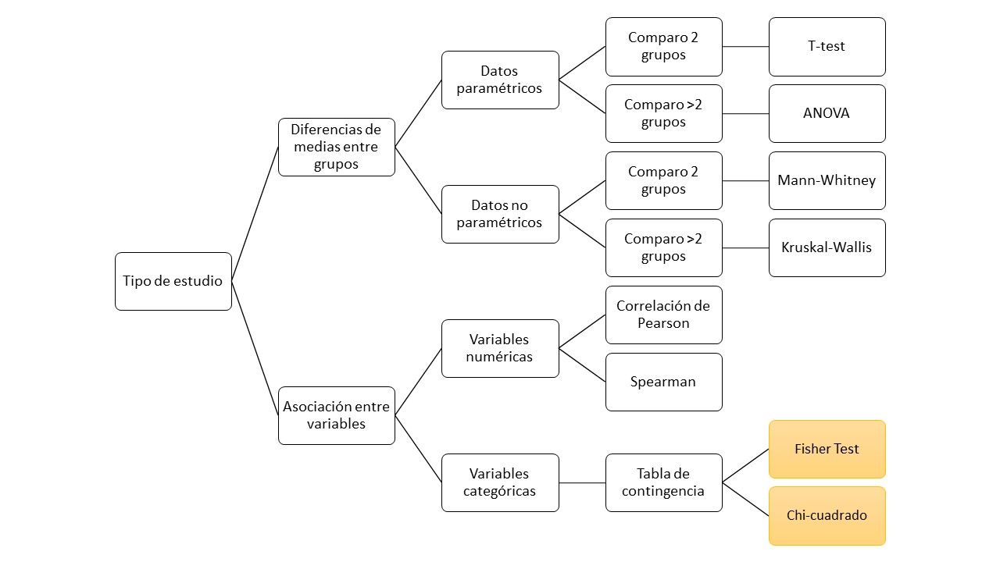

---

## Teoria:

.footnote[
McCrum-Gardner, Evie. 2008. “Which Is the Correct Statistical Test to Use?” British Journal of Oral and Maxillofacial Surgery 46 (1): 38–41.
]

Las pruebas de independencia se utilizan para determinar si existe una relación significativa entre dos variables categóricas. Existen dos tipos diferentes de prueba de independencia:

- la prueba de Chi-cuadrado (la más común) `chisq.test()`
- la prueba exacta de Fisher `fisher.test()`

--

Por un lado, la prueba de Chi-cuadrado se utiliza cuando la muestra es lo suficientemente grande (en este caso, el p.valor es una aproximación que se vuelve exacta cuando la muestra se vuelve infinita, como es el caso de muchas pruebas estadísticas). 

--
Por otro lado, la prueba exacta de Fisher se usa cuando la muestra es pequeña (y en este caso el p.valor es exacto y no es una aproximación).

--

La literatura indica que la regla usual para decidir si la aproximación de χ2 es lo suficientemente buena es que la prueba Chi-cuadrado no es apropiada cuando los valores esperados en una de las celdas de la tabla de contingencia es menor a 5, y en este caso la prueba de Fisher es preferible.


---
**Seguimos con nuestro ejemplo**

> Vamos a analizar la posible relación entre que la madre fume y que el bebé tenga bajo peso o no

1- Vamos a generar la tabla de contingencia y visualizar nuestros datos

2- Vamos a aplicar el test estadístico

---

### Tabla de contingencia:
La creamos con la función `table`:
```{r contingency_table}
freq<-table(mydata$mother_smoke, mydata$baby_low_weight)
freq
```
--
Y ahora vamos a organizar los datos para representarlos en un gráfico de barras:
```{r}
freqbyrow<-proportions(table(mydata$mother_smoke, mydata$baby_low_weight),1)
freqbyrow<- as.data.frame(freqbyrow)                  # transform the table into a data frame
colnames(freqbyrow)<-c("mother_smoke","baby_low_weight","Freq")
freqbyrow
```

---
class: center middle
```{r barplot, out.width="70%"}
ggbarplot(freqbyrow, x="mother_smoke", y="Freq",       # x = variable filas de la tabla    
          color = "baby_low_weight",                            
          label = TRUE, lab.pos = 'in',
          lab.nb.digits = 2)  +                  # num dígitos de las proporciones
  theme(legend.position = 'right')
```

---
class: center middle

```{r grafica2, out.width="70%"}
ggplot(mydata, aes(x=mother_smoke, fill = baby_low_weight)) + 
  geom_bar(position = 'fill') + 
  scale_y_continuous(labels = scales::percent) +
  theme_classic2() + 
  theme(axis.title.y = element_blank())
```


---
Aplicamos la prueba chi-cuadrado de independència entre dos factors:

```{r}
chisq.test(freq)
```
Cuándo la tabla de frecuencias es de 2x2 también podemos aplicar el test de Fisher:

```{r fisher}
fisher.test(freq)
```

---
class: center middle inverse

# ¿Hacemos un último ejercicio juntos y probamos el chi-cuadrado en RStudio?

---

```{r}
library(dplyr)
starwars
star <- starwars
```

---

```{r}
star %>% mutate_if(is.character, as.factor) -> star
str(star[,1:11])
```
---

```{r}
star$human <- ifelse(star$species == "Human", yes= 'human', no = 'other')

table(star$gender, star$human)
```
> Existe alguna asociación entre el género de los personajes y si pertenecen a la raza humana? 👽👾


---
class: title-slide center middle

## ¡Gracias por vuestra atención!
📧 corraliza@recerca.clinic.cat
